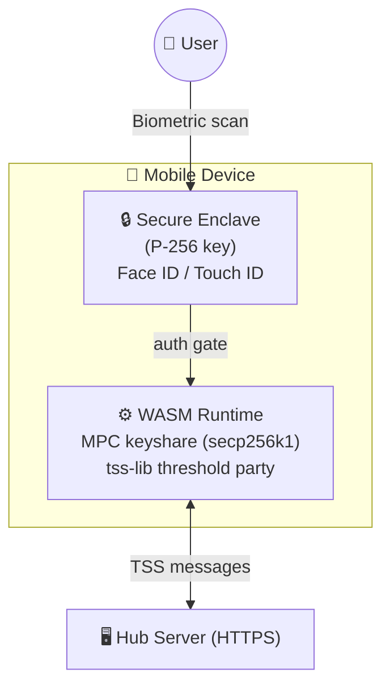
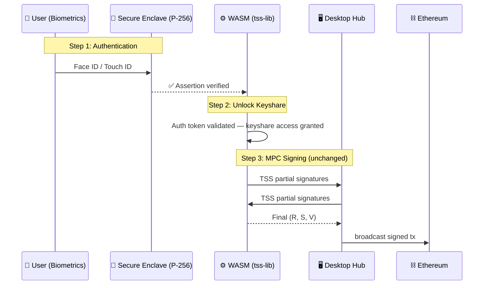
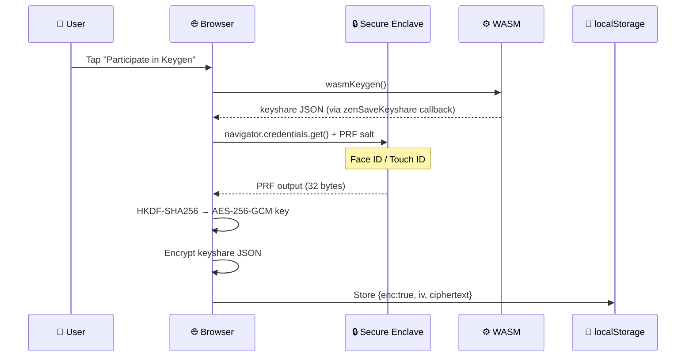
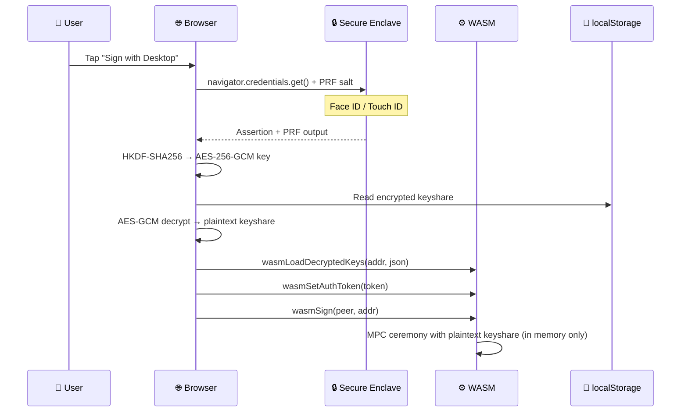

# 🚀 Zen MPC Wallet

ZenWallet is a truly **Decentralized, Mobile-First Multi-Party Computation (MPC)** cryptographic wallet demonstration. 

Rather than relying on closed-source backend mainframes to control smartphone "dummy" nodes, ZenWallet compiles the ultra-heavy cryptographic threshold algorithms into WebAssembly (WASM). This allows your iOS or Android device's native browser to perform distributed offline key generation and transaction signatures using its own CPU without ever exposing private data!

## 🧩 Architecture

ZenWallet runs deeply on a `2-of-3` threshold signature scheme (`n=3, t=1`) spanning directly across three devices via Local Wi-Fi bridging.

- **📱 Mobile Array:** Two separate smart devices handle computation dynamically using `main.wasm`.
- **💻 Desktop Hub:** Your local PC functions natively as the final `Node 1` keyholder, while seamlessly acting as the transparent Wi-Fi Message Router tracking transactions.

### ✨ Key Features
- **Zero App Download:** It operates robustly as a Progressive Web App (PWA). No App Store downloads required.
- **Air-Gapped Local Storage:** Your mobile keyshares are stored safely inside the physical `localStorage` of your smartphone. The Desktop has strictly zero visibility into your Mobile fractions!
- **Dynamic Multiple Wallets:** Support for an endless keychain. Zen Wallet gracefully multiplexes all generated keys directly to their public Ethereum Addresses.
- **Complete Disaster Recovery:** A fully functioning Disaster Recovery matrix means if your Desktop's `desktop_keys.json` file burns to a crisp, the two Mobile Phones can completely bypass it and blindly combine remote thresholds to save your transaction!
- **🔐 Passkey Authentication:** Mobile devices require biometric verification (Face ID / Touch ID) via WebAuthn before every signing operation. Your keyshares are protected by hardware-backed authentication.

---

## 🔐 Passkey (WebAuthn) Integration

ZenWallet uses **WebAuthn Passkeys** as a biometric gatekeeper for MPC signing operations on mobile devices. This means every transaction must be explicitly authorized by the device owner through Face ID, Touch ID, or equivalent platform authenticator.

### How It Works



### Signing Flow

1. **User taps "Sign"** on the mobile interface
2. **WebAuthn challenge** is requested from the Hub server
3. **Biometric prompt** appears — Face ID or Touch ID on the device
4. **Assertion is verified** server-side and a short-lived auth token is issued
5. **Auth token is passed to WASM** — the MPC engine only proceeds if the token is present
6. **MPC ceremony executes** — the threshold signature is computed collaboratively
7. **Auth token is consumed** — one-time use per signing operation

### Key Design Decisions

| Aspect | Detail |
|:---|:---|
| **Passkey Role** | Authentication gatekeeper — does NOT participate in MPC math |
| **Curve** | Passkey uses secp256r1 (P-256); MPC uses secp256k1 — no curve bridging needed |
| **Scope** | One passkey per mobile device, gates ALL wallets on that device |
| **Token Lifetime** | 5 minutes, single-use (consumed after each sign) |
| **HTTPS Requirement** | WebAuthn requires a secure context; hub serves HTTPS via self-signed TLS cert |

---

## 🏎️ Running the Demo Locally

### Prerequisites
1. Ensure you have **Go 1.24+** installed.
2. Install **Anvil** (`foundry`) or have a generic local EVM chain spinning if you want mock transactions to successfully execute.

### Boot Sequence

Clone the repository and run the startup script right off the bat!

```bash
cd ZenWallet
chmod +x run_demo.sh
./run_demo.sh
```

**What this script does under the hood:**
1. Spins up a fresh local EVM `anvil` environment at port `8545`.
2. Downloads standard Golang WASM execution scripts.
3. Automatically transpiles `mobile_wasm.go` into `static/main.wasm`.
4. Generates a self-signed TLS certificate (first run only).
5. Compiles and launches `hub_server.go` on `https://localhost:8081`.

### ⚠️ Trusting the Self-Signed Certificate

Since WebAuthn requires HTTPS, the server uses a locally generated TLS certificate. When you first connect from your mobile device, you'll see a browser safety warning.

**On your phone:**
1. Open `https://<YOUR_LOCAL_IP>:8081/ui/` in Safari or Chrome
2. Tap **"Advanced"** → **"Proceed anyway"** (or equivalent)
3. The page will load and WASM will initialize normally

> This is only necessary once per device. The certificate is valid for 1 year.

---

## 🎮 How to Test the Wallet

Once your servers boot gracefully:

1. **Open the Dashboard:** Go to `https://localhost:8081/ui/` in your Desktop Browser. Accept the certificate warning.
2. **Generate Native Keys:** Click `Generate New MPC Wallet` freely to add brand-new Multi-Party Wallets to your Active Selector Dropdown.
3. **Connect Your Phones:** Ensure your mobile phones are natively connected to exactly the same Local Wi-Fi as your PC. Open your iPhone or Android camera to individually scan the `Mobile 1` and `Mobile 2` QR codes.
4. **Offline Computation:** Keep an eye out for `"WASM Crypto Engine Active"`. Select a Wallet from the dropdown and hit **Participate in Keygen** to securely generate matching shards onto your phone.
5. **Register Passkey:** After keygen completes on a mobile device, you'll be prompted to register a passkey. Tap to register — this triggers Face ID / Touch ID and creates a hardware-backed credential. You can also tap the **"Register Passkey"** button at any time.
6. **Approve a Transaction:** Select a wallet and tap **"Sign with Desktop"**. Your phone will prompt Face ID / Touch ID for biometric verification. Only after successful authentication will the WASM MPC engine start computing the threshold signature.

### Passkey Status Indicator

On the mobile UI, you'll see a **Passkey** status badge in the info panel:
- 🔐 **Registered** (green) — passkey is set up, signing is enabled
- ⚠️ **Not Registered** (yellow) — you must register a passkey before you can sign

---

## 🔐 Passkey + MPC Wallet: Integration Architecture

The integration of passkeys adds a **biometric authentication layer** that protects access to the MPC keyshares stored on each mobile device. There are three distinct architectural strategies, each with different trade-offs.

### Strategy 1: Passkey as Keyshare Gatekeeper ✅ (Current Implementation)

> **Passkey does NOT participate in MPC math — it protects access to the keyshare**

This is the most pragmatic approach and fits perfectly into the existing architecture.



**Implementation details:**
- `mobile_wasm.go` — `wasmSign` is gated behind an auth token set by JS after WebAuthn assertion
- `static/index.html` — `navigator.credentials.get()` triggers Face ID / Touch ID before every sign
- `hub_server.go` — 6 WebAuthn endpoints handle registration/authentication ceremonies
- Auth tokens are single-use and expire after 5 minutes

> **Key advantage:** Zero changes to the MPC cryptographic layer. The TSS ceremony, the secp256k1 signing, and the Ethereum transaction flow remain completely untouched.

---

## 🔒 Encrypted Keyshare Storage (WebAuthn PRF)

Mobile keyshares are encrypted at rest using **hardware-backed keys** derived from the device's Secure Enclave via the [WebAuthn PRF extension](https://w3c.github.io/webauthn/#prf-extension). The encryption key is **never stored** — it's derived on-the-fly during biometric authentication.

### How It Works

| Layer | Technology | Purpose |
|:---|:---|:---|
| **Secure Enclave** | Apple A-series / Android Titan M | Stores P-256 key, computes HMAC-based PRF |
| **PRF Extension** | WebAuthn Level 3 (built into browser) | Derives 32-byte secret from Secure Enclave |
| **Key Derivation** | HKDF-SHA256 | Converts PRF output → AES-256-GCM key |
| **Encryption** | AES-256-GCM (Web Crypto API) | Encrypts keyshare JSON before localStorage write |

> No installation required — PRF is a built-in browser capability (Safari 18+, Chrome 120+).

### Keygen → Encrypt → Store



### Authenticate → Decrypt → Sign



### Fallback Behavior

When the PRF extension is not supported (older browsers/authenticators), ZenWallet falls back to **plaintext `localStorage`** storage — the same behavior as before. The passkey badge on the mobile UI indicates the encryption status:

- 🔒 **Registered (Encrypted)** — keyshares are encrypted with hardware-backed key
- 🔐 **Registered** — passkey works, but PRF not supported (plaintext storage)
- ⚠️ **Not Registered** — no passkey, no encryption

---

## 🏛️ Enterprise Security: Desktop HSM Integration

To protect the server-side architecture, the Desktop Hub supports native **Hardware Security Module (HSM)** integration via the **PKCS#11** standard. When enabled, desktop keyshares are never stored on disk in plaintext and are never exposed during rest.

### How It Works

| Layer | Architecture |
|:---|:---|
| **Storage at Rest** | Desktop keyshares are encrypted via AES-256-GCM. The Key Encryption Key (KEK) is generated and resides permanently inside the HSM. |
| **Runtime Decryption** | Keyshares are decrypted dynamically only in memory during a signing ceremony, then aggressively zeroed out. |
| **Entropy (TRNG)** | The Distributed Key Generation (DKG) `PreParams` ceremony relies on the HSM's True Random Number Generator for maximum cryptographic entropy. |

### Running with HSM

For local development, we use **SoftHSM2**, a software emulation of a cryptographic token. 

```bash
# Provide the --hsm flag to the demo script
./run_demo.sh --hsm
```

The script will:
1. Initialize a `zenwallet` SoftHSM token if it doesn't exist
2. Compile the Desktop Hub using `//go:build hsm` tags (which links `crypto11` and `pkcs11`)
3. Interactively prompt you for the HSM PIN (`1234` by default)
4. Encrypt all newly generated keyshares into `.enc` ciphertext files instead of `.json`.

> [!WARNING]
> **Disaster Recovery (HA):** Because keyshares are securely bound to the HSM, losing the HSM configuration or KEK results in permanent loss of the Desktop keyshare. For production, organizations must perform standard HSM Key Export Ceremonies to securely backup the KEK to redundant geographic regions. (Note: because ZenWallet uses a `2-of-3` scheme, the two mobile clients can still independently recover the wallet even if the Desktop HSM is physically destroyed).
