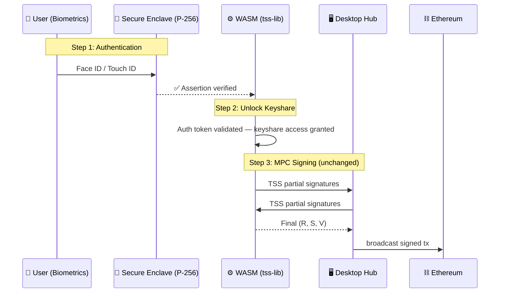
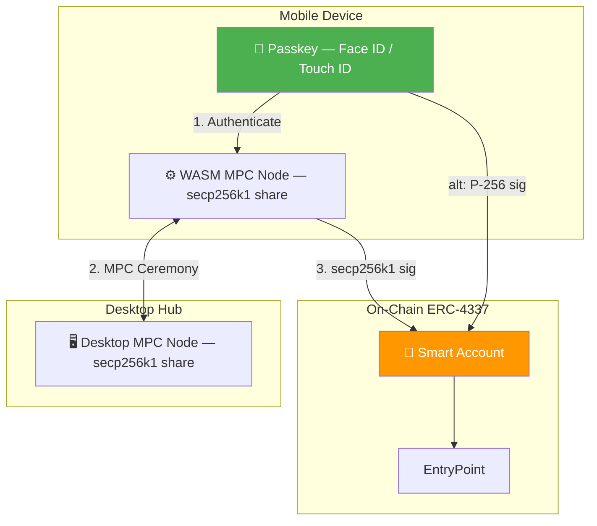

# 🚀 Zen MPC Wallet

ZenWallet is a truly **Decentralized, Mobile-First Multi-Party Computation (MPC)** cryptographic wallet demonstration. 

Rather than relying on closed-source backend mainframes to control smartphone "dummy" nodes, ZenWallet compiles the ultra-heavy cryptographic threshold algorithms into WebAssembly (WASM). This allows your iOS or Android device's native browser to perform distributed offline key generation and transaction signatures using its own CPU without ever exposing private data!

## 🧩 Architecture

ZenWallet runs deeply on a `2-of-3` threshold signature scheme (`n=3, t=1`) spanning directly across three devices via Local Wi-Fi bridging.

- **📱 Mobile Array:** Two separate smart devices handle computation dynamically using `main.wasm`.
- **💻 Desktop Hub:** Your local PC functions natively as the final `Node 1` keyholder, while seamlessly acting as the transparent Wi-Fi Message Router tracking transactions.

### ✨ Key Features
- **Zero App Download:** It operates robustly as a Progressive Web App (PWA). No App Store downloads required.
- **Air-Gapped Local Storage:** Your mobile keyshares are stored safely inside the physical `localStorage` of your smartphone. The Desktop has strictly zero visibility into your Mobile fractions!
- **Dynamic Multiple Wallets:** Support for an endless keychain. Zen Wallet gracefully multiplexes all generated keys directly to their public Ethereum Addresses.
- **Complete Disaster Recovery:** A fully functioning Disaster Recovery matrix means if your Desktop's `desktop_keys.json` file burns to a crisp, the two Mobile Phones can completely bypass it and blindly combine remote thresholds to save your transaction!
- **🔐 Passkey Authentication:** Mobile devices require biometric verification (Face ID / Touch ID) via WebAuthn before every signing operation. Your keyshares are protected by hardware-backed authentication.

---

## 🔐 Passkey (WebAuthn) Integration

ZenWallet uses **WebAuthn Passkeys** as a biometric gatekeeper for MPC signing operations on mobile devices. This means every transaction must be explicitly authorized by the device owner through Face ID, Touch ID, or equivalent platform authenticator.

### How It Works

```
┌─────────────────────────────────────────────────────┐
│  Mobile Device                                       │
│                                                      │
│  ┌──────────────┐    ┌────────────────────────────┐ │
│  │ Secure Encl. │    │      WASM Runtime           │ │
│  │  (P-256 key) │───▶│  MPC keyshare (secp256k1)  │ │
│  │  Face ID /   │auth│  tss-lib threshold party    │ │
│  │  Touch ID    │gate│                              │ │
│  └──────────────┘    └────────────────────────────┘ │
│        ▲                         │                   │
│   Biometric scan           TSS messages              │
│                                  ▼                   │
└──────────────────────── Hub Server (HTTPS) ──────────┘
```

### Signing Flow

1. **User taps "Sign"** on the mobile interface
2. **WebAuthn challenge** is requested from the Hub server
3. **Biometric prompt** appears — Face ID or Touch ID on the device
4. **Assertion is verified** server-side and a short-lived auth token is issued
5. **Auth token is passed to WASM** — the MPC engine only proceeds if the token is present
6. **MPC ceremony executes** — the threshold signature is computed collaboratively
7. **Auth token is consumed** — one-time use per signing operation

### Key Design Decisions

| Aspect | Detail |
|:---|:---|
| **Passkey Role** | Authentication gatekeeper — does NOT participate in MPC math |
| **Curve** | Passkey uses secp256r1 (P-256); MPC uses secp256k1 — no curve bridging needed |
| **Scope** | One passkey per mobile device, gates ALL wallets on that device |
| **Token Lifetime** | 5 minutes, single-use (consumed after each sign) |
| **HTTPS Requirement** | WebAuthn requires a secure context; hub serves HTTPS via self-signed TLS cert |

---

## 🏎️ Running the Demo Locally

### Prerequisites
1. Ensure you have **Go 1.24+** installed.
2. Install **Anvil** (`foundry`) or have a generic local EVM chain spinning if you want mock transactions to successfully execute.

### Boot Sequence

Clone the repository and run the startup script right off the bat!

```bash
cd ZenWallet
chmod +x run_demo.sh
./run_demo.sh
```

**What this script does under the hood:**
1. Spins up a fresh local EVM `anvil` environment at port `8545`.
2. Downloads standard Golang WASM execution scripts.
3. Automatically transpiles `mobile_wasm.go` into `static/main.wasm`.
4. Generates a self-signed TLS certificate (first run only).
5. Compiles and launches `hub_server.go` on `https://localhost:8081`.

### ⚠️ Trusting the Self-Signed Certificate

Since WebAuthn requires HTTPS, the server uses a locally generated TLS certificate. When you first connect from your mobile device, you'll see a browser safety warning.

**On your phone:**
1. Open `https://<YOUR_LOCAL_IP>:8081/ui/` in Safari or Chrome
2. Tap **"Advanced"** → **"Proceed anyway"** (or equivalent)
3. The page will load and WASM will initialize normally

> This is only necessary once per device. The certificate is valid for 1 year.

---

## 🎮 How to Test the Wallet

Once your servers boot gracefully:

1. **Open the Dashboard:** Go to `https://localhost:8081/ui/` in your Desktop Browser. Accept the certificate warning.
2. **Generate Native Keys:** Click `Generate New MPC Wallet` freely to add brand-new Multi-Party Wallets to your Active Selector Dropdown.
3. **Connect Your Phones:** Ensure your mobile phones are natively connected to exactly the same Local Wi-Fi as your PC. Open your iPhone or Android camera to individually scan the `Mobile 1` and `Mobile 2` QR codes.
4. **Offline Computation:** Keep an eye out for `"WASM Crypto Engine Active"`. Select a Wallet from the dropdown and hit **Participate in Keygen** to securely generate matching shards onto your phone.
5. **Register Passkey:** After keygen completes on a mobile device, you'll be prompted to register a passkey. Tap to register — this triggers Face ID / Touch ID and creates a hardware-backed credential. You can also tap the **"Register Passkey"** button at any time.
6. **Approve a Transaction:** Select a wallet and tap **"Sign with Desktop"**. Your phone will prompt Face ID / Touch ID for biometric verification. Only after successful authentication will the WASM MPC engine start computing the threshold signature.

### Passkey Status Indicator

On the mobile UI, you'll see a **Passkey** status badge in the info panel:
- 🔐 **Registered** (green) — passkey is set up, signing is enabled
- ⚠️ **Not Registered** (yellow) — you must register a passkey before you can sign

---

## 🔐 Passkey + MPC Wallet: Integration Architecture

The integration of passkeys adds a **biometric authentication layer** that protects access to the MPC keyshares stored on each mobile device. There are three distinct architectural strategies, each with different trade-offs.

### Strategy 1: Passkey as Keyshare Gatekeeper ✅ (Current Implementation)

> **Passkey does NOT participate in MPC math — it protects access to the keyshare**

This is the most pragmatic approach and fits perfectly into the existing architecture.



**Implementation details:**
- `mobile_wasm.go` — `wasmSign` is gated behind an auth token set by JS after WebAuthn assertion
- `static/index.html` — `navigator.credentials.get()` triggers Face ID / Touch ID before every sign
- `hub_server.go` — 6 WebAuthn endpoints handle registration/authentication ceremonies
- Auth tokens are single-use and expire after 5 minutes

> **Key advantage:** Zero changes to the MPC cryptographic layer. The TSS ceremony, the secp256k1 signing, and the Ethereum transaction flow remain completely untouched.

---

### Strategy 2: Passkey as an MPC Share (Advanced — Future)

> **The passkey's P-256 key BECOMES one of the three threshold shares**

This is the architecturally "purest" approach but introduces significant complexity due to the **curve mismatch problem**.

#### The Curve Mismatch

| Component | Curve | Standard |
|:---|:---|:---|
| WebAuthn Passkeys | **secp256r1** (P-256) | NIST / FIDO2 |
| Ethereum / Bitcoin | **secp256k1** (Koblitz) | Bitcoin / Ethereum |
| ZenWallet's `tss-lib` | **secp256k1** | `tss.S256()` |

These are mathematically incompatible curves. You **cannot** directly use a passkey's secp256r1 signature in a secp256k1 MPC ceremony.

#### Option A: MPC Curve Bridge (Off-Chain)

The MPC network produces a secp256k1 signature, but one of the participants authenticates via their secp256r1 passkey:

```
┌─────────────────────────────────────────────┐
│  Mobile Device                               │
│                                              │
│  ┌──────────────┐    ┌───────────────────┐  │
│  │ Secure Encl. │    │    WASM Runtime    │  │
│  │  (P-256 key) │───▶│  secp256k1 share   │  │
│  │              │auth│  (tss-lib party)   │  │
│  └──────────────┘    └───────────────────┘  │
│        ▲                      │              │
│   Face ID / Touch ID     TSS messages        │
│                               ▼              │
└───────────────────────── Hub Server ─────────┘
```

The passkey authenticates the *user*, and a software-based secp256k1 keyshare (stored encrypted, decrypted only after passkey auth succeeds) performs the actual MPC computation. This is effectively a more sophisticated version of Strategy 1.

#### Option B: Account Abstraction with RIP-7212 (On-Chain)

Use ERC-4337 smart accounts that can natively verify secp256r1 signatures:


> ⚠️ **RIP-7212 is only available on select chains** (Base, Optimism, Polygon, Arbitrum, some L3s). Ethereum L1 mainnet does NOT have this precompile yet. On unsupported chains, verifying P-256 on-chain costs ~600k-900k gas.

#### Share Distribution with Passkey-as-Share

| Share | Holder | Curve | Purpose |
|:---|:---|:---|:---|
| Share 1 | Desktop Hub (file-based) | secp256k1 | Server-side participant |
| Share 2 | Mobile Passkey (Secure Enclave) | secp256r1 | Hardware-backed biometric auth |
| Share 3 | Recovery (cloud/paper backup) | secp256k1 | Disaster recovery |

> ⚠️ This model fundamentally changes the MPC architecture. The `tss-lib` library operates exclusively on secp256k1. Having a passkey *participate* as a share would require a custom MPC protocol that bridges the two curves — this is active academic research.

---

### Strategy 3: Hybrid — Passkey Auth + Account Abstraction (Production-Grade — Future)

> **Best of both worlds: MPC for key management, Passkey for UX, Smart Account for on-chain flexibility**



#### Why This Is the Best Long-Term Architecture

1. **MPC (secp256k1)** handles day-to-day signing with the existing `tss-lib` setup
2. **Passkey (secp256r1)** provides biometric gating before MPC ceremonies begin
3. **Smart Account (ERC-4337)** provides:
   - **Key rotation** without changing the on-chain address
   - **Social recovery** modules
   - **Spending limits** and policies
   - **Multi-sig upgrade path** — the smart account can accept *either* secp256k1 MPC signatures *or* secp256r1 passkey signatures as valid signers
4. **RIP-7212** enables gas-efficient passkey signature verification when available

---

### Implementation Roadmap

| Phase | Strategy | Status | Description |
|:---|:---|:---|:---|
| **Phase 1** | Passkey as Gatekeeper | ✅ Done | WebAuthn registration + biometric auth before every sign |
| **Phase 2** | Encrypted Keyshare Storage | 🔜 Next | AES-GCM encrypt keyshares in `localStorage` using Web Crypto API |
| **Phase 3** | Smart Account (ERC-4337) | 📋 Planned | Deploy smart account wallet + dual-signer validation (MPC or passkey) |
